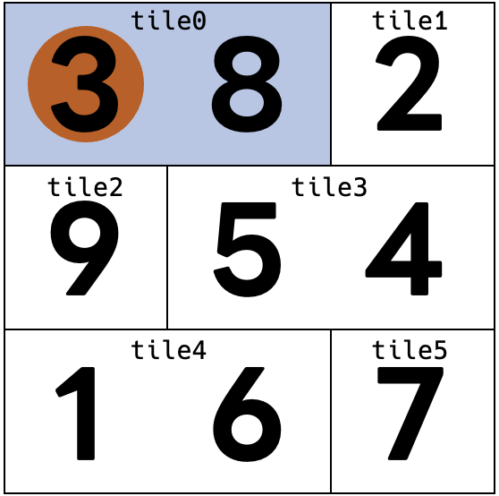

# AHC002 Walking on Tiles
- [AHC002 Walking on Tiles](#ahc002-walking-on-tiles)
  - [問題文](#問題文)
  - [入力](#入力)
    - [入力具体例](#入力具体例)
  - [出力](#出力)
  - [ビジュアライザからわかること](#ビジュアライザからわかること)
  - [実装](#実装)

## 問題文
 　$ 1 \times 1 $, $ 1 \times 2 $, $ 2 \times 1 $の３種類のタイルが敷き詰められた$ 50 \times 50 $の床を$ (si, sj) $から移動し、移動経路上のマスに書かれた数字の合計を得点として得ることができる。
できるだけ高い得点を得られる移動経路を求めよ。
ただし、移動には以下の条件がある。

- $ (i, j) $から移動できるのは$ (i-1, j), (i+1, j), (i, j-1), (i, j+1) $の４方向
- 同じタイルは2度踏めない


## 入力
```math
\begin{align*}
& si \space sj \\
& t_{0, 0} \space t_{0, 1} \space \dots \space t_{0, 49} \\
& \vdots \\
& t_{49, 0} \space t_{49, 1} \space \dots \space t_{49, 49} \\
& p_{0, 0} \space p_{0, 1} \space \dots \space p_{0, 49} \\
& \vdots \\
& p_{49, 0} \space p_{49, 1} \space \dots \space p_{49, 49} 
\end{align*}
```
$ 0 \le si, sj \le 49 $
タイルの総数を$M$とすると
$ 0 \le t_{i, j} \le M-1 $
$ 0 \le p_{i, j} \le 99 $

### 入力具体例
```
0 0
0 0 1
2 3 3
4 4 5
3 8 2
9 5 4
1 6 7
```
このケースは説明のため床の広さが$3 \times 3$になっている。本番では$50 \times 50$となることに注意。  

## 出力
  $ (i,j) $ からの移動をそれぞれ
$ (i−1,j):U $  
$ (i+1,j):D $  
$ (i,j-1):L $  
$ (i,j+1):R $  
として、移動経路を文字列で表し、1行で出力せよ。


## ビジュアライザからわかること

`tools/src/bin/lib.rs`
```rust
pub fn compute_score_detail(input: &Input, out: &Output) -> (i32, String, Vec<usize>, Vec<(usize, usize)>) {
	let mut used = vec![0; N * N];  //本当はタイルの総数Mで十分だが、N*Nで足りなくなることはない
	let (mut i, mut j) = input.s; // 現在位置、最初はスタート地点
	used[input.tiles[i][j]] = 1; // スタート地点を踏む
	let mut score = input.ps[i][j]; // スタート地点の得点も含む
	let mut steps = vec![(i, j)]; // 通った経路
	let mut err = String::new();
	for c in out.chars() { // 出力を一文字ずつ見ていく
		let (di, dj) = match c { // cがLRUDのうちどれかによって値を変える
			'L' => (0, !0), // Lなら(0, !0)
			'R' => (0, 1), // 以下略
			'U' => (!0, 0),
			'D' => (1, 0),
			_ => {
				return (0, "Illegal output".to_owned(), used, steps);
			}
		};
		i += di; // 現在地点から移動
		j += dj;
		if i >= N || j >= N {
			return (0, "Out of range".to_owned(), used, steps);
		}
		steps.push((i, j));
		if used[input.tiles[i][j]] != 0 {
			err = "Stepped on the same tile twice".to_owned();
		}
		used[input.tiles[i][j]] += 1;
		score += input.ps[i][j];
	}
	if err.len() > 0 {
		score = 0;
	}
	(score, err, used, steps)
}
```
わりと素直な実装な気がします。

> ##### !0について
> Rustのusize型は実行環境によってu32かu64として扱われる**符号なし**の整数型です。
> Rustでは配列のindexは必ずusize型にしなければいけない決まりがあり、困ってしまうのが、グリッド探索をしたい今回のような場合です。
> (`[(1, 0), (0, 1), (-1, 0), (0, -1)]`のような配列を作れない)
> そこでわざとオーバーフローを起こし `i + !0 = i - 1` とするテクニックが競プロではよく使われます(業プロでも使われますか？)
> `!0`は`0`のbit否定(pythonでいう`~`チルダ)で、usizeの最大値をとります。
> `0 + !0 = !0`(>N)となるので境界条件の設定が`(i + di) < N`だけで済みます。
> [えびちゃん先生とのやりとり](https://twitter.com/rsk0315_h4x/status/1588542877269098497)も是非ご覧ください


## 実装
[世界四連覇AIエンジニアがゼロから教えるゲーム木探索入門](https://qiita.com/thun-c/items/058743a25c37c87b8aa4)のゲーム例: 数字集め迷路にそっくりじゃありませんか。
