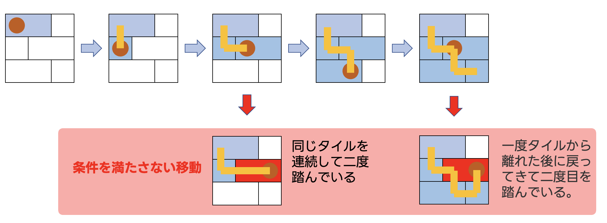
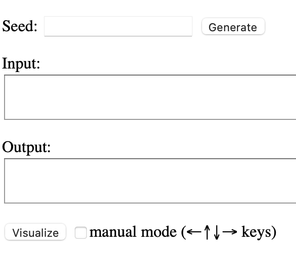
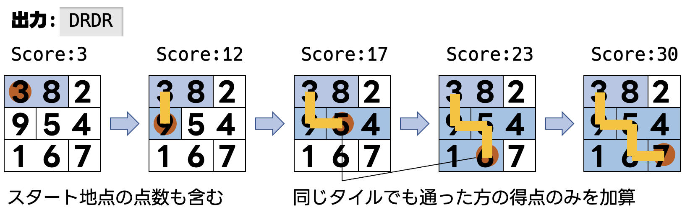

# AHC002 Walking on Tiles 〜問題文読解編〜
- [AHC002 Walking on Tiles 〜問題文読解編〜](#ahc002-walking-on-tiles-問題文読解編)
  - [問題文](#問題文)
  - [マニュアルモードで遊ぼう！](#マニュアルモードで遊ぼう)
  - [入力](#入力)
    - [入力具体例](#入力具体例)
  - [出力](#出力)
  - [正の得点を得る](#正の得点を得る)
  - [おわりに](#おわりに)

## 問題文
 大きさが
 $ 50 \times 50 $
 マスの床に、大きさが
 $ 1 \times 1 $, $ 1 \times 2 $ (横長), $ 2 \times 1 $ (縦長)の３種類のタイルが敷き詰められている。スタート地点の座標
 $ (si, sj) $
 から移動し、移動経路上のマスに書かれた数字の合計を得点として得ることができるとき、できるだけ高い得点を得られる移動経路を求めよ。
ただし、移動には以下の条件がある。

- $ (i, j) $
  から移動できるのは
  $ (i-1, j), (i+1, j), (i, j-1), (i, j+1) $
  の４方向
- 同じタイルは2度踏めない


## マニュアルモードで遊ぼう！
[Web版ビジュアライザ](https://img.atcoder.jp/ahc002/e5b2b399792299b5b35543c219e89601.html)にmanual modeが実装されているときがあります。その場合はまずマニュアルで遊んでみましょー！  
**百聞は一見にしかず！！！**  
すぐに問題文を理解できることでしょう。

`Seed: `に適当な数字を入力し、`Visualize`ボタンを押下します。  
`□ manual mode`にチェックを入れると、方向キーで遊べます！！

私はこれぐらいで飽きました…

## 入力
```math
\begin{align*}
& si \space sj \\
& t_{0, 0} \space t_{0, 1} \space \dots \space t_{0, 49} \\
& \vdots \\
& t_{49, 0} \space t_{49, 1} \space \dots \space t_{49, 49} \\
& p_{0, 0} \space p_{0, 1} \space \dots \space p_{0, 49} \\
& \vdots \\
& p_{49, 0} \space p_{49, 1} \space \dots \space p_{49, 49} 
\end{align*}
```
$ 0 \le si, sj \le 49 $
タイルの総数を$M$とすると
$ 0 \le t_{i, j} \le M-1 $
$ 0 \le p_{i, j} \le 99 $

### 入力具体例
```
0 0
0 0 1
2 3 3
4 4 5
3 8 2
9 5 4
1 6 7
```
このケースは説明のため床の広さが$3 \times 3$になっている。本番では$50 \times 50$となることに注意。  

上記の入力はこのような盤面を表しています。
## 出力
$ (i,j) $ からの移動をそれぞれ
$ (i−1,j):U $  
$ (i+1,j):D $  
$ (i,j-1):L $  
$ (i,j+1):R $  
として、移動経路を文字列で表し、1行で出力せよ。




## 正の得点を得る
この記事の目標です。  
どのAHCでもまずは最初に**高い点数を得ようとせず、最小限の点数を得る**ことをオススメします。  
今回の出力は移動経路ですが、`WA`にならないように、ただ得点を得るだけならば…？  

答えは
[この問題のFirst AC](https://atcoder.jp/contests/ahc002/submissions/22062445)

## おわりに
いよいよ第2回みんなでAHCを解く会コンテスト（長いのでいい名称を募集中です）が始まりました。今回はサンプルコードで