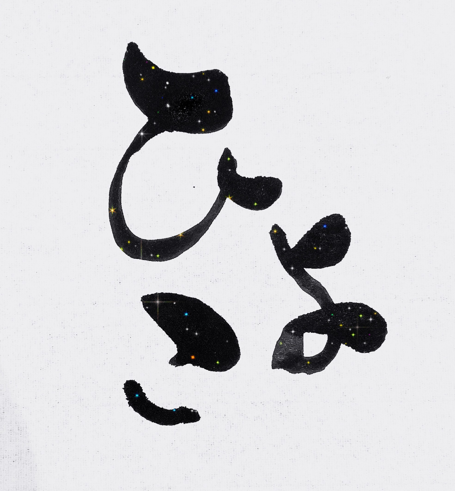

<strong>三尺秋水</strong>

| ID                                                          | name             | best perf | language |
| ----------------------------------------------------------- | ---------------- | --------- | -------- |
| [Gex777](https://atcoder.jp/users/Gex777)                   | スコテイ(Gex777) | 755       | cpp      |
| [gabriel55_](https://atcoder.jp/users/gabriel55_)           | がぶりえる       | 1361      | cpp      |
| [rinrion](https://atcoder.jp/users/rinrion)                 | rinrion          | 1448      | cpp      |
| [jabee](https://atcoder.jp/users/jabee)                     | jabee            | 1582      | cpp      |
| [fujikawahiroaki](https://atcoder.jp/users/fujikawahiroaki) | fujikawahiroaki  | 1595      | crystal  |

<strong>ひよこ</strong>

| ID                                                    | name         | best perf | language        |
| ----------------------------------------------------- | ------------ | --------- | --------------- |
| [bk_cocoa](https://atcoder.jp/users/bk_cocoa)         | bk_cocoa     | 781       | python          |
| [nakashiii](https://atcoder.jp/users/nakashiii)       | nakashiii    | 1322      | cpp rust        |
| [kokatsu](https://atcoder.jp/users/kokatsu)           | kokatsu      | 1456      | D               |
| [nephrologist](https://atcoder.jp/users/nephrologist) | Nephrologist | 1545      | rust python cpp |
| [bio4eta](https://atcoder.jp/users/bio4eta)           | 4eta         | 1722      | python          |

<strong>焼きにゃまし隊</strong>

| ID                                                    | name     | best perf | language    |
| ----------------------------------------------------- | -------- | --------- | ----------- |
| [meowmeowcats](https://atcoder.jp/users/meowmeowcats) | あべみ   | 1069      | python      |
| [inaba3](https://atcoder.jp/users/inaba3)             | 1783     | 1301      | PHP         |
| [akane831](https://atcoder.jp/users/akane831)         | akane831 | 1509      | cpp         |
| [r3yohei](https://atcoder.jp/users/r3yohei)           | ぱらぼろ | 1531      | rust python |
| [hiraku](https://atcoder.jp/users/hiraku)             | hiraku   | 1790      | python rust |

<strong>Moréchond</strong>

| ID                                                  | name       | best perf | language |
| --------------------------------------------------- | ---------- | --------- | -------- |
| [yas_yasyu](https://atcoder.jp/users/yas_yasyu)     | yas_yasyu  | 1071      | python   |
| [michirakara](https://atcoder.jp/users/michirakara) | michirakra | 1287      | python   |
| [keroru](https://atcoder.jp/users/keroru)           | keroru     | 1528      | python   |
| [kaede2020](https://atcoder.jp/users/kaede2020)     | kaede2020  | 1529      | cpp      |
| [kuruton456](https://atcoder.jp/users/kuruton456)   | クルトン   | 1800      | python   |

<strong>a1nem</strong>

| ID                                                      | name                                 | best perf | language           |
| ------------------------------------------------------- | ------------------------------------ | --------- | ------------------ |
| [a9ua1i0n](https://atcoder.jp/users/a9ua1i0n)           | a9ua1i0n                             | 1823      | rust cpp python c# |
| [jaku](https://atcoder.jp/users/jaku)                   | jakusw                               | 1827      | python             |
| [ococonomy1](https://atcoder.jp/users/ococonomy1)       | ococonomy1                           | 1840      | cpp                |
| [uni_kakurenbo](https://atcoder.jp/users/uni_kakurenbo) | みどりむし(uni_kakurenbo)[A:緑/H:水] | 1860      | cpp python         |
| [baku1101](https://atcoder.jp/users/baku1101)           | baku1101                             | 2123      | rust cpp           |

<strong>俺はタスマニア！お前は何マニア？</strong>

| ID                                                | name       | best perf | language   |
| ------------------------------------------------- | ---------- | --------- | ---------- |
| [amylase](https://atcoder.jp/users/amylase)       | amylase    | 1835      | cpp python |
| [takekinmkk](https://atcoder.jp/users/takekinmkk) | たけきー   | 1874      | cpp        |
| [ogawakun](https://atcoder.jp/users/ogawakun)     | ogawakun   | 2045      | cpp        |
| [G4NP0N](https://atcoder.jp/users/G4NP0N)         | G4NP0N     | 2148      | c# python  |
| [tardigrade](https://atcoder.jp/users/tardigrade) | tardigrade | 2194      | cpp python |